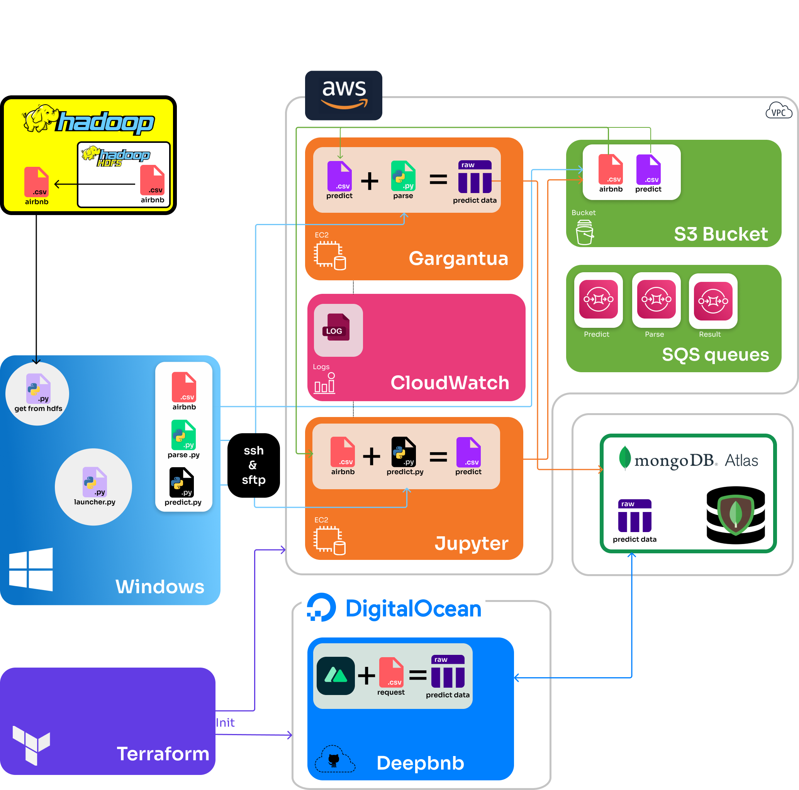

# Big data project

This application was realized at Télécom Saint-Étienne for the Big Data project course.

## Subject

This project has two objectives: data analysis and the proposal of a model for the prediction of the price per night.
This requires an architecture on the AWS cloud to run machine learning scripts.

The project consists of several parts: 
- training a model with a dataset in the cloud
- prediction of the results of an ad sent on a web application thanks to the learned model
- visualization and storage of the results on a MongoDB database

# Architecture

This application is divided into several microservices hosted on other repos:

- [client web app](https://github.com/tse-projects/deepbnb), a NuxtJS application to create a housing ad
- [notebook](https://github.com/tse-projects/kairos), a jupyter notebook to do data mining, research and training of a model  
- [infrastructure](), a NuxtJS server for the client application

This repo allows you to create the infrastructure with Terraform. The script `init_launcher.py` allows to prepare 
the instances and finally `launcher.py` allows to launch the processes in each server. 

##Global scheme


### AWS 
#### Jupyter and Gargantua
These machines are EC2 t2.micro instances that respectively perform the prediction and the parsing of the results in the
MongoDB database. They are synchronized thanks to messaging queues (predictQueue & parseQueue). 

#### Cloudwatch
Logs of EC2 instances and python scripts are collected on this platform.

#### SQS queues
We have 3 messaging queues that allow our different instances and applications to communicate:
PredictQueue : Deepbnb or local script >Jupyter
ParsingQueue : Jupyter > Gargantua
ResultQueue : Gargantua > Deepbnb

The messages sent are used to signal the next runtime to retrieve the file name from the storage bucket. 

#### S3 Bucket
This S3 file server allows to store the prediction files but also the result files.

### MongoDB Atlas
Atlas-managed MongoDB cluster deployed in the cloud that stores prediction results and dataset.

### Deepbnb 
See [deepbnb](https://github.com/tse-projects/deepbnb)

### Terraform
Allows creating, update and destroy the cloud infrastructure (EC2, keypairs, security groups, web app...) 

## Workflow
### Infrastructure creation
Step 0 (manual operation):
Configure your aws cli and put also your credentials in `terraform.tfvars`

Step 1 (manual operation) : Create the infrastructure with terraform
```bash
terraform apply
terraform output -json > ./infrastructure.json
```


Step 2 (manual operation): Init ec2 machines. This will upload python scripts and install all needed dependencies.
```bash
python init_launcher.py
```


Step 3 (manual operation): Start the processes on Jupyter and Gargantua. Then copy the dataset from HDFS and upload it on S3 
(you need to configure the hadoop command in `hadoop`).
```bash
python launcher.py
```
From now on, two processes are running on each EC2 instance. The next steps are performed automatically each time a message is sent to predictQueue.


Step 4 (auto): Jupyter receives a message from PredictQueue that a file has been dropped. It downloads it and runs the
machine learning model to get a prediction csv. It then uploads this file to S3 and sends a message to ParseQueue.


Step 5 (auto): Gargantua receives a message from ParseQueue. It downloads the file from S3 and parse it then sends it 
to the Mongo database. Finally, it sends a message to ResultQueue


Step 6 (auto): If the sender of the PredictQueue message was Deepbnb, it listens to the ResultQueue queue and retrieves 
the new document from the database.

## If you want to run it

### Prerequisites
- A mongoDB cluster
- An AWS account with credentials
- A Digitalocean account with credentials
- Download the models from [cloud](https://www.swisstransfer.com/d/7594916e-6a84-49b6-b376-cea712321684)

Insert your variables in `terraform.tfvars`

```tfvars
aws_access_key_id     = "insert_your_value"
aws_secret_access_key = "insert_your_value"
aws_session_token     = "insert_your_value"
mongo_credentials     = {
  MONGO_USERNAME = "insert_your_value"
  MONGO_CLUSTER  = "insert_your_value"
  MONGO_DATABASE = "insert_your_value"
  MONGO_PASSWORD = "insert_your_value"
}
digitalocean_token    = "insert_your_value"
```

